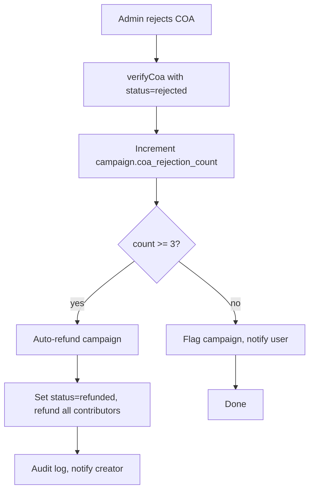

# COA 3-Strikes Auto-Refund & Admin Queue Links — Implementation Plan

## Overview

Two features:

1. **3-Strikes Rule**: Track how many times a user has submitted COAs that were manually rejected for a campaign. After 3 rejections, the campaign is auto-refunded (user is trying something nefarious).
2. **Admin Queue Links**: Add clickable links to the campaign detail page and user detail page in the COA admin queue table.

---

## Architecture



---

## Changes by Layer

### 1. Database Schema — `packages/bff/prisma/schema.prisma`

Add a new field to the `Campaign` model:

```prisma
model Campaign {
  // ... existing fields ...
  coa_rejection_count Int @default(0)
  // ... rest of fields ...
}
```

- **Type**: `Int`, default `0`
- **Purpose**: Tracks the number of COAs that were manually rejected for this campaign
- **Incremented**: Each time an admin rejects a COA (in `verifyCoa` with `status: 'rejected'`)
- **Reset**: Never reset — this is a monotonic counter for fraud detection

### 2. Prisma Migration

Create migration `packages/bff/prisma/migrations/YYYYMMDDHHMMSS_coa_rejection_count/migration.sql`:

```sql
ALTER TABLE "campaign" ADD COLUMN "coa_rejection_count" INTEGER NOT NULL DEFAULT 0;
```

### 3. Backend Service — `packages/bff/src/services/coa.service.ts`

Update the `verifyCoa()` method's rejection branch:

**Current behavior (rejection branch):**

```ts
// Rejected
const campaign = await this.prisma.campaign.findUniqueOrThrow({
  where: { id: coa.campaign_id },
});
await this.prisma.coa.update({ ... });
await this.prisma.campaign.update({
  where: { id: coa.campaign_id },
  data: {
    is_flagged_for_review: true,
    flagged_reason: `COA rejected: ${dto.notes ?? 'no reason given'}`,
  },
});
// notify user, audit log
```

**New behavior (rejection branch):**

```ts
// Rejected
const campaign = await this.prisma.campaign.findUniqueOrThrow({
  where: { id: coa.campaign_id },
});

await this.prisma.coa.update({ ... });

// Increment rejection counter and check for 3-strikes
const updated = await this.prisma.campaign.update({
  where: { id: coa.campaign_id },
  data: {
    is_flagged_for_review: true,
    flagged_reason: `COA rejected: ${dto.notes ?? 'no reason given'}`,
    coa_rejection_count: { increment: 1 },
  },
});

if (updated.coa_rejection_count >= 3) {
  // 3 strikes — auto-refund the campaign
  await this.campaignService.refundContributions(
    coa.campaign_id,
    'Campaign auto-refunded: 3 COAs rejected — potential fraud'
  );
  await this.audit.log({
    userId: callerId,
    action: 'campaign.auto_refunded_3_strikes',
    entityType: 'campaign',
    entityId: coa.campaign_id,
    changes: { reason: '3 COAs rejected' },
  });
} else {
  // Notify user to re-upload
  await this.notifService.send(
    campaign.creator_id,
    'coa_uploaded',
    coa.campaign_id,
    'COA Rejected',
    `Your COA for sample was rejected: ${dto.notes ?? 'no reason given'}. Rejection ${updated.coa_rejection_count}/3. After 3 rejections, the campaign will be auto-refunded.`
  );
}

this.audit.log({
  userId: callerId,
  action: 'coa.rejected',
  entityType: 'coa',
  entityId: coaId,
});
```

### 4. AdminCoaDto — `packages/common/src/dtos/admin.dto.ts`

Add fields for creator info and rejection count:

```ts
export interface AdminCoaDto {
  // ... existing fields ...
  creator_id: string;
  creator_email: string;
  creator_username: string | null;
  coa_rejection_count: number;
}
```

### 5. Admin Service — `packages/bff/src/services/admin.service.ts`

Update `listCoas()` to include creator info and rejection count:

In the Prisma query `include`, add creator:

```ts
include: {
  campaign: {
    select: {
      title: true,
      verification_code: true,
      creator_id: true,
      coa_rejection_count: true,
      creator: { select: { email: true, username: true } },
    }
  },
  // ... rest ...
}
```

In the DTO mapping:

```ts
return {
  // ... existing fields ...
  creator_id: c.campaign.creator_id,
  creator_email: c.campaign.creator.email,
  creator_username: c.campaign.creator.username,
  coa_rejection_count: c.campaign.coa_rejection_count,
};
```

### 6. API Client Regeneration

Run `pnpm generate:client` from repo root to regenerate `packages/api-client/src/generated/` with the updated `AdminCoaDto` shape.

### 7. Frontend — CoasTab.tsx

Update the COA card to show:

- Rejection count badge (e.g., "Rejections: 2/3" with amber/red coloring)
- Clickable link to campaign detail page (`/campaigns/{campaign_id}`)
- Clickable link to user admin page (`/admin/users` with user filter, or a direct user detail route if one exists)

**Rejection count badge:**

```tsx
{
  coa.verification_status === 'rejected' && (
    <span className="text-xs font-medium text-warning">
      Rejections: {coa.coa_rejection_count}/3
    </span>
  );
}
{
  coa.coa_rejection_count >= 2 && coa.verification_status !== 'rejected' && (
    <span className="text-xs font-medium text-danger">
      ⚠ {coa.coa_rejection_count}/3 rejections
    </span>
  );
}
```

**Clickable links:**

```tsx
<div className="flex items-center gap-2 flex-wrap">
  <a
    href={`/campaigns/${coa.campaign_id}`}
    target="_blank"
    rel="noopener noreferrer"
    className="font-bold text-primary hover:underline truncate"
  >
    {coa.campaign_title}
  </a>
  <AdminStatusBadge status={coa.verification_status} />
</div>
<div className="flex items-center gap-x-4 gap-y-1 text-sm text-text-2 flex-wrap">
  <span>
    Creator:{' '}
    <a
      href={`/admin?tab=users&search=${encodeURIComponent(coa.creator_email)}`}
      target="_blank"
      rel="noopener noreferrer"
      className="text-primary hover:underline"
    >
      {coa.creator_username ?? coa.creator_email}
    </a>
  </span>
  {/* ... rest of metadata ... */}
</div>
```

### 8a. Frontend — AdminPage.tsx (URL param support)

Update AdminPage to read `tab` from URL search params so that links like `/admin?tab=users` open the correct tab:

```tsx
import { useSearchParams } from 'react-router-dom';

export function AdminPage(): React.ReactElement {
  const { user } = useAuth();
  const [searchParams] = useSearchParams();
  const initialTab = searchParams.get('tab') ?? 'campaigns';

  // ... existing guard ...

  return (
    <AppShell>
      <PageContainer>
        <h1 className="text-xl font-bold text-text mb-4">Admin Panel</h1>
        <Tabs tabs={tabs} defaultTab={initialTab} />
      </PageContainer>
    </AppShell>
  );
}
```

### 8b. Frontend — UsersTab.tsx (URL search param support)

Update UsersTab to read `search` from URL search params so that links like `/admin?tab=users&search=email@example.com` pre-fill the search:

```tsx
import { useSearchParams } from 'react-router-dom';

export function UsersTab(): React.ReactElement {
  const [searchParams] = useSearchParams();
  const urlSearch = searchParams.get('search') ?? '';
  const [search, setSearch] = useState(urlSearch);
  // ... rest of component ...
```

### 8c. Frontend — CoaVerifyModal.tsx

Add rejection count warning at the top of the modal:

```tsx
{
  coa.coa_rejection_count >= 2 && (
    <div className="bg-red-50 border border-red-200 rounded-xl p-3 text-sm text-red-700">
      ⚠ This campaign has {coa.coa_rejection_count}/3 COA rejections. One more rejection will
      auto-refund the campaign.
    </div>
  );
}
{
  coa.coa_rejection_count === 1 && (
    <div className="bg-amber-50 border border-amber-200 rounded-xl p-3 text-sm text-amber-700">
      This campaign has 1/3 COA rejections.
    </div>
  );
}
```

---

## Testing Plan

### Unit Tests — `packages/bff/src/services/__tests__/coa.service.test.ts`

1. **Test: First COA rejection** — `coa_rejection_count` becomes 1, campaign flagged, user notified, no refund
2. **Test: Second COA rejection** — `coa_rejection_count` becomes 2, campaign flagged, user notified with warning, no refund
3. **Test: Third COA rejection (3 strikes)** — `coa_rejection_count` becomes 3, campaign auto-refunded, status becomes `refunded`, contributors refunded, audit log written
4. **Test: COA approval does not affect counter** — `coa_rejection_count` stays unchanged on approval

### Integration Tests

1. Upload COA → reject → upload again → reject → upload again → reject → verify campaign is refunded
2. Verify admin queue shows correct rejection count and links

---

## Risk Assessment

| Risk                                                                   | Mitigation                                                                                                                             |
| ---------------------------------------------------------------------- | -------------------------------------------------------------------------------------------------------------------------------------- |
| `refundContributions` may fail if escrow is empty                      | The existing `refundContributions` already handles this — it throws `InsufficientBalanceError` which will bubble up                    |
| Race condition: multiple admins reject same COA simultaneously         | COA `verification_status` update is atomic; second rejection on already-rejected COA will be a no-op since the COA is already rejected |
| User re-uploads after rejection, gets a fresh COA that's also rejected | Each manual rejection increments the counter regardless of which sample — this is per-campaign, not per-sample                         |

---

## Files Changed Summary

| File                                                             | Change                                                                                        |
| ---------------------------------------------------------------- | --------------------------------------------------------------------------------------------- |
| `packages/bff/prisma/schema.prisma`                              | Add `coa_rejection_count Int @default(0)` to Campaign                                         |
| `packages/bff/prisma/migrations/.../migration.sql`               | New migration                                                                                 |
| `packages/bff/src/services/coa.service.ts`                       | Update rejection branch: increment counter, check 3-strikes, auto-refund                      |
| `packages/common/src/dtos/admin.dto.ts`                          | Add `creator_id`, `creator_email`, `creator_username`, `coa_rejection_count` to `AdminCoaDto` |
| `packages/bff/src/services/admin.service.ts`                     | Update `listCoas()` to include creator info and rejection count                               |
| `packages/api-client/src/generated/*`                            | Regenerated                                                                                   |
| `packages/fe/src/pages/admin/tabs/CoasTab.tsx`                   | Show rejection count badge, clickable links                                                   |
| `packages/fe/src/pages/admin/components/coas/CoaVerifyModal.tsx` | Show rejection warning                                                                        |
| `packages/fe/src/pages/admin/AdminPage.tsx`                      | Add URL param support for tab selection                                                       |
| `packages/fe/src/pages/admin/tabs/UsersTab.tsx`                  | Add URL search param support                                                                  |
| `packages/bff/src/services/__tests__/coa.service.test.ts`        | Add 3-strikes tests                                                                           |
