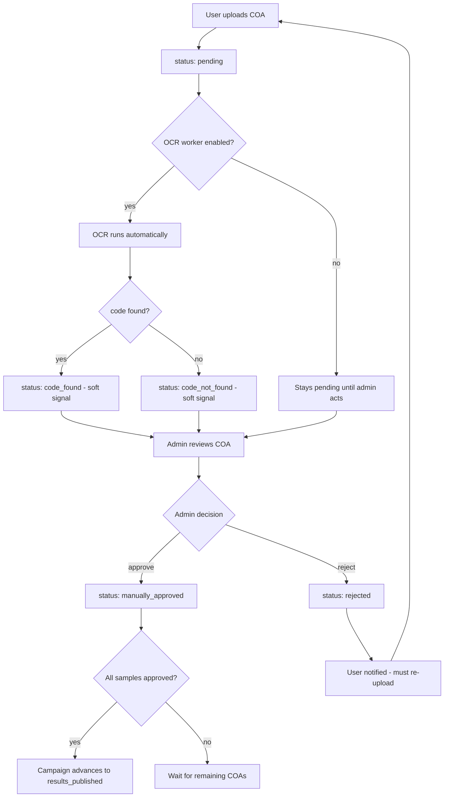

# COA Admin Approval Flow — Implementation Plan

## Background & Problem Statement

The current system runs OCR on uploaded COAs and uses the result (`code_found` / `code_not_found`) as the **final** verification gate. This is wrong:

1. OCR is unreliable — PDFs vary in layout, scan quality, and encoding
2. `code_found` alone is currently sufficient to automatically advance a campaign to `results_published` — no human ever reviews it
3. There is no admin UI to see, approve, or reject COAs
4. If a COA is rejected by admin, users have no clear in-app signal to take action
5. There is no way to trigger OCR on demand or disable the auto-background worker

---

## Desired State



**Key invariant change:** Only `manually_approved` counts toward campaign advancement. `code_found` is informational only.

---

## COA State Machine

| Status              | Meaning                                           | Can re-upload? | Counts toward advancement? |
| ------------------- | ------------------------------------------------- | -------------- | -------------------------- |
| `pending`           | OCR in flight (or worker disabled)                | No             | No                         |
| `code_found`        | OCR found code — awaiting admin review            | No             | **No (changed)**           |
| `code_not_found`    | OCR could not find code — admin may still approve | Yes            | No                         |
| `manually_approved` | Admin explicitly approved                         | No             | Yes                        |
| `rejected`          | Admin rejected — user must re-upload              | Yes            | No                         |

---

## Changes by Layer

---

### 1. BFF — `packages/bff/src/config/env.config.ts`

Add one new env var:

```ts
DISABLE_OCR_WORKER: bool({ default: false }),
```

This controls whether the auto-background OCR queue processor starts. Requires a server restart to take effect. When `true`, jobs may still be enqueued after upload (they sit in Redis) but **nothing processes them**.

---

### 2. BFF — `packages/bff/src/container.ts`

Gate the `startOcrWorker()` call:

```ts
void import('./workers/ocr.worker').then(({ startOcrWorker }) => {
  if (!env.DISABLE_OCR_WORKER) {
    startOcrWorker();
  }
});
```

---

### 3. BFF — `packages/bff/src/services/coa.service.ts`

**Fix `verifyCoa()` — remove `code_found` from advancement count:**

```ts
// BEFORE (wrong — OCR alone advances campaign)
verification_status: { in: ['code_found', 'manually_approved'] },

// AFTER (correct — only explicit admin approval counts)
verification_status: { in: ['manually_approved'] },
```

Also add a new public method `runOcrForAdmin(coaId: string): Promise<CoaDto>` that:

- Finds the COA
- Calls `OcrService.processCoaPdf()` directly (synchronous, not via queue)
- Persists the result (ocr_text + status)
- Returns the updated COA DTO

---

### 4. BFF — `packages/bff/src/services/admin.service.ts`

Add two new methods:

#### `listCoas(status?, page, limit) → PaginatedResponseDto<AdminCoaDto>`

Fetches COAs joined with their campaign title and sample label. Supports filtering by `verification_status`. Default ordering: `uploaded_at DESC`.

#### `runOcr(coaId: string) → AdminCoaDto`

Delegates to `CoaService.runOcrForAdmin(coaId)`. Returns the updated COA with OCR text included.

---

### 5. BFF — `packages/bff/src/controllers/admin.controller.ts`

Two new endpoints:

```
GET  /admin/coas?status=&page=&limit=   → PaginatedResponseDto<AdminCoaDto>
POST /admin/coas/:id/run-ocr            → AdminCoaDto
```

Both require `@Security('jwt')` (admin claim already enforced by auth middleware for all `/admin` routes).

---

### 6. Common — `packages/common/src/dtos/admin.dto.ts`

Add `AdminCoaDto` interface (richer than the user-facing `CoaDto` — includes OCR text and campaign/sample context):

```ts
export interface AdminCoaDto {
  id: string;
  sample_id: string;
  campaign_id: string;
  campaign_title: string;
  campaign_verification_code: number;
  sample_label: string;
  file_url: string; // pre-signed S3 URL
  file_name: string;
  file_size_bytes: number;
  uploaded_at: string; // ISO
  verification_status: VerificationStatus;
  verification_notes: string | null;
  verified_at: string | null;
  ocr_text: string | null; // full raw OCR output — admin only
}
```

No new request DTO needed for run-ocr (path param only, no body).

---

### 7. FE — `packages/fe/src/api/queryKeys.ts`

Add to `admin` namespace:

```ts
coas: (filters: { status?: string; page?: number }) =>
  ['admin', 'coas', filters] as const,
```

---

### 8. FE — `packages/fe/src/api/hooks/useAdmin.ts`

Add two hooks:

```ts
useAdminCoas(filters); // GET /admin/coas
useAdminRunOcr(); // POST /admin/coas/:id/run-ocr mutation
```

`useAdminCoas` invalidates on successful verify/run-ocr.
`useAdminRunOcr` invalidates `queryKeys.admin.coas({})` on success.

---

### 9. FE — New `CoasTab.tsx`

**Path:** `packages/fe/src/pages/admin/tabs/CoasTab.tsx`

Layout:

- Status filter pills: All | Pending Review | Approved | Rejected
  - "Pending Review" = status IN (pending, code_found, code_not_found)
- Each COA row shows:
  - Campaign title + verification code chip
  - Sample label
  - OCR status badge (soft signal):
    - `pending` → gray "OCR Pending"
    - `code_found` → teal "Code Found"
    - `code_not_found` → amber "Code Not Found"
    - `manually_approved` → green "Approved"
    - `rejected` → red "Rejected"
  - Uploaded date
  - "View PDF" → opens pre-signed URL in new tab
  - "Run OCR" button → triggers `useAdminRunOcr`, available for any non-approved status
  - "Approve" button → opens `CoaVerifyModal` pre-set to approve
  - "Reject" button → opens `CoaVerifyModal` pre-set to reject
- Pagination (page-based, not infinite scroll — admin list pattern)
- Empty state if no COAs match filter

---

### 10. FE — New `CoaVerifyModal.tsx`

**Path:** `packages/fe/src/pages/admin/components/coas/CoaVerifyModal.tsx`

```
┌────────────────────────────────┐
│ Approve / Reject COA           │
│                                │
│  [Approve] [Reject]  ← toggle  │
│                                │
│  Notes (optional)              │
│  ┌──────────────────────────┐  │
│  │                          │  │
│  └──────────────────────────┘  │
│                                │
│  OCR Result (informational):   │
│  Status: Code Found            │
│  ────────────────────────────  │
│  [raw OCR text excerpt]        │
│                                │
│  [Cancel]         [Confirm]    │
└────────────────────────────────┘
```

Uses the existing `useAdminVerifyCoa` hook. On success, invalidates `queryKeys.admin.coas({})`.

---

### 11. FE — `AdminPage.tsx`

Add the "COAs" tab entry between Campaigns and Users (or at a logical position). The tab label shows a count badge of pending-review COAs (pending + code_found + code_not_found).

---

### 12. FE — User-facing rejection state

**File:** `packages/fe/src/pages/CampaignDetailPage.tsx` (and/or the COA upload sub-component)

When `sample.coa.verification_status === 'rejected'`:

- Show a red banner: _"Your COA was rejected: [verification_notes]"_
- Show a "Replace COA" upload button (existing upload form)

When `sample.coa.verification_status === 'code_not_found'`:

- Show an amber banner: _"OCR could not find the verification code in your COA. The lab will review manually — or you may re-upload."_
- Show the re-upload option

When `sample.coa` is `null` and campaign is `samples_sent`:

- Show the upload prompt (existing)

These states are already structurally supported by the backend (`rejected` → allows re-upload, notification already sent). This is purely a UI clarity improvement.

---

## What Does NOT Change

- `VerificationStatus` enum in Prisma — no migration needed; all values already exist
- The `POST /admin/coas/:id/verify` endpoint — already exists and works correctly
- `uploadCoa()` guard logic — `code_found` and `manually_approved` still block re-upload; `rejected` and `code_not_found` still allow it
- The notification sent on rejection — already fires via `NotificationService`

---

## No-DB-Migration Needed

All schema types (`VerificationStatus` enum values) already exist. The only data-model change is the **service logic** treating `code_found` as unverified for campaign advancement purposes. Existing `code_found` rows in the DB are unaffected — they simply now require an admin to act on them.

---

## Open Questions / Follow-ups

1. Should `ocr_text` be exposed on the user-facing `CoaDto` at all? Currently not. Keeping it admin-only in `AdminCoaDto` is the right call for now.
2. Should re-running OCR reset `verified_at` / `verified_by_user_id`? Recommended: yes, clear those fields when OCR is re-run to avoid stale attribution.
3. Should we add a `coa_rejected` `NotificationType` enum value to the schema for cleaner notifications? Worth a future migration — currently uses `coa_uploaded` type with a custom title/message.
